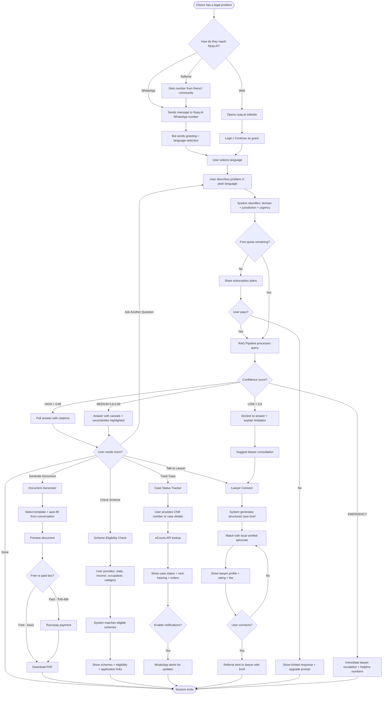

# Nyay.AI — Use Case Diagram & Application Flow

## 1. Actors

| Actor | Description |
|-------|-------------|
| **Citizen (Free)** | Any Indian with a legal problem. Uses WhatsApp or web. 10 free queries/day. |
| **Citizen (Paid)** | Subscribed user (₹99–₹999/mo). Unlimited queries + documents + priority. |
| **Lawyer** | Verified advocate on the marketplace. Receives referrals, pays per lead. |
| **Admin** | Nyay.AI team. Manages corpus, reviews outputs, monitors quality. |
| **B2B Client** | NBFC / bank / NGO using Nyay.AI API for their own users. |
| **Government** | NALSA / state legal aid boards using the platform under B2G contracts. |

---

## 2. Use Case Diagram

```mermaid
graph TB
    subgraph Actors
        C1[👤 Citizen - Free]
        C2[👤 Citizen - Paid]
        L[⚖️ Lawyer]
        A[🔧 Admin]
        B2B[🏢 B2B Client]
        GOV[🏛️ Government]
    end

    subgraph "Nyay.AI Platform"
        subgraph "Core Features"
            UC1[Ask Legal Question]
            UC2[Get Rights Explanation]
            UC3[Generate Legal Document]
            UC4[Check Scheme Eligibility]
            UC5[Track Case Status]
            UC6[Connect with Lawyer]
        end

        subgraph "User Management"
            UC7[Register / Login]
            UC8[Manage Subscription]
            UC9[View Query History]
            UC10[Rate Lawyer]
        end

        subgraph "Lawyer Features"
            UC11[Receive Referral with Brief]
            UC12[Accept / Decline Referral]
            UC13[View Client Case Summary]
            UC14[Manage Profile & Ratings]
        end

        subgraph "Admin Features"
            UC15[Monitor RAG Quality]
            UC16[Review Flagged Responses]
            UC17[Manage Legal Corpus]
            UC18[View Analytics Dashboard]
        end

        subgraph "B2B / B2G"
            UC19[Access API Endpoint]
            UC20[Embed Chat Widget]
            UC21[Bulk Query Processing]
        end
    end

    C1 --> UC1
    C1 --> UC2
    C1 --> UC4
    C1 --> UC5
    C1 --> UC6
    C1 --> UC7

    C2 --> UC1
    C2 --> UC2
    C2 --> UC3
    C2 --> UC4
    C2 --> UC5
    C2 --> UC6
    C2 --> UC8
    C2 --> UC9
    C2 --> UC10

    L --> UC11
    L --> UC12
    L --> UC13
    L --> UC14

    A --> UC15
    A --> UC16
    A --> UC17
    A --> UC18

    B2B --> UC19
    B2B --> UC20
    GOV --> UC19
    GOV --> UC21
```

---

## 3. Application Flow — Citizen Journey

---

## 4. Feature-wise Use Cases

### UC1: Ask Legal Question
| Field | Detail |
|-------|--------|
| **Actor** | Citizen (Free/Paid) |
| **Precondition** | User is on WhatsApp or web interface |
| **Flow** | 1. User types question in any supported language → 2. System detects language → 3. Translates to English (if needed) → 4. RAG retrieves relevant legal documents → 5. LLM generates grounded answer with citations → 6. Translates back to user's language → 7. Delivers response |
| **Postcondition** | User receives cited legal information |
| **Alternate** | Low confidence → escalate to lawyer |

### UC3: Generate Legal Document
| Field | Detail |
|-------|--------|
| **Actor** | Citizen (Paid) or à la carte purchase |
| **Precondition** | User has described their situation |
| **Flow** | 1. System suggests applicable document template → 2. Auto-fills from conversation context → 3. User reviews and edits → 4. Payment (if paid template) → 5. Download as PDF |
| **Postcondition** | User has a legally formatted document ready to file |
| **Templates** | RTI application, legal notice, consumer complaint, police complaint, tenant notice, cheque bounce notice, RERA complaint |

### UC4: Check Scheme Eligibility
| Field | Detail |
|-------|--------|
| **Actor** | Citizen (Free/Paid) |
| **Precondition** | None |
| **Flow** | 1. User provides basic info (state, income, occupation, category, family) → 2. System queries 500+ schemes → 3. Returns matching schemes with eligibility criteria → 4. Provides application checklist + form links |
| **Postcondition** | User knows which schemes they qualify for |

### UC6: Connect with Lawyer
| Field | Detail |
|-------|--------|
| **Actor** | Citizen (Free/Paid) |
| **Precondition** | User's query requires professional legal help |
| **Flow** | 1. System generates structured brief from conversation → 2. Matches with local advocates by domain + location → 3. Shows lawyer profiles with ratings → 4. User selects → 5. Referral sent to lawyer with full brief |
| **Postcondition** | Lawyer receives pre-qualified lead with context |
