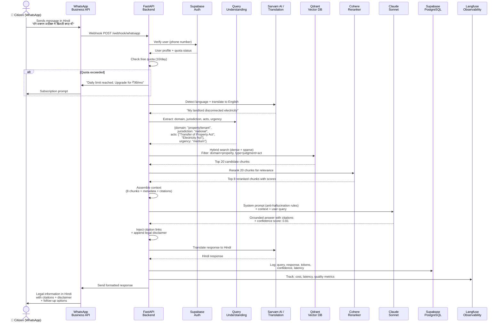
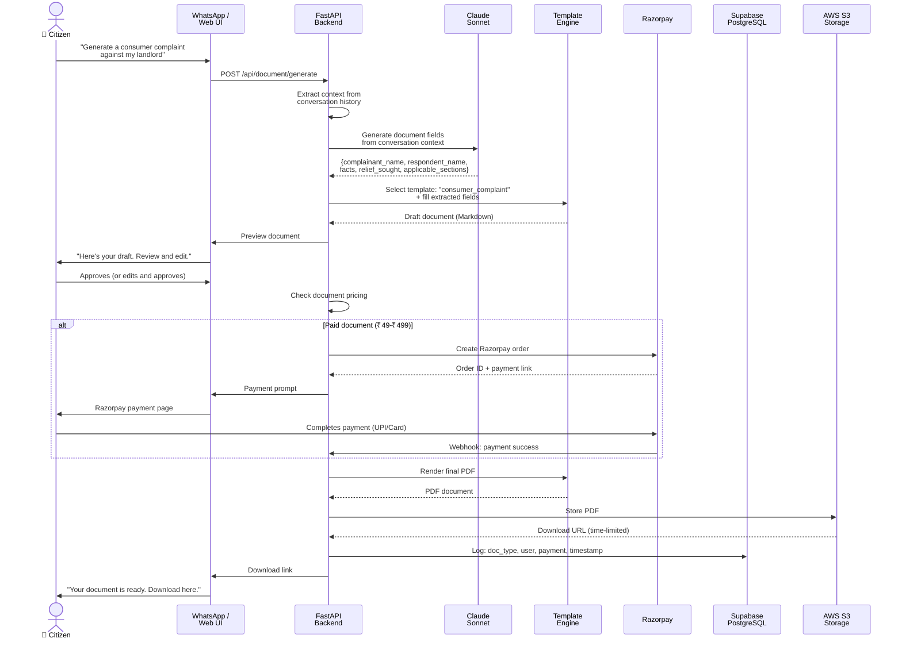
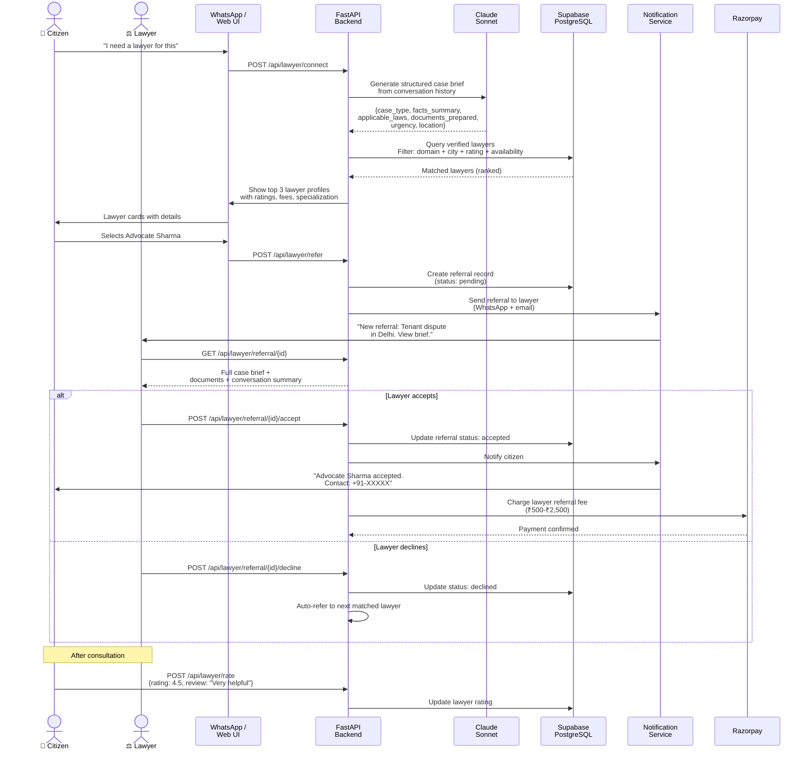
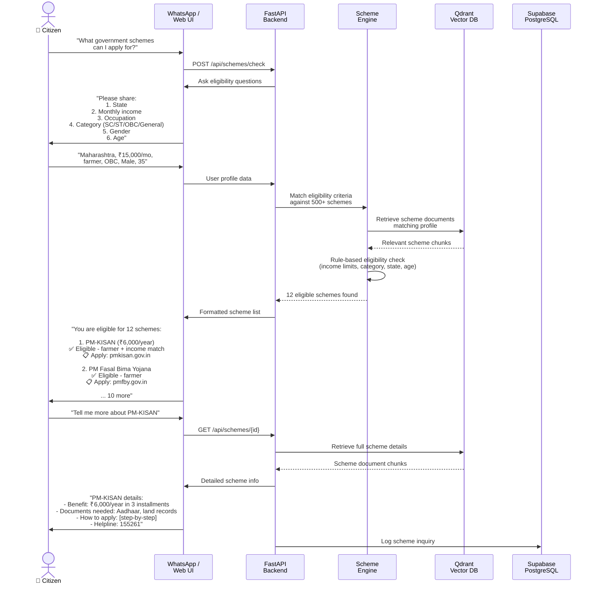
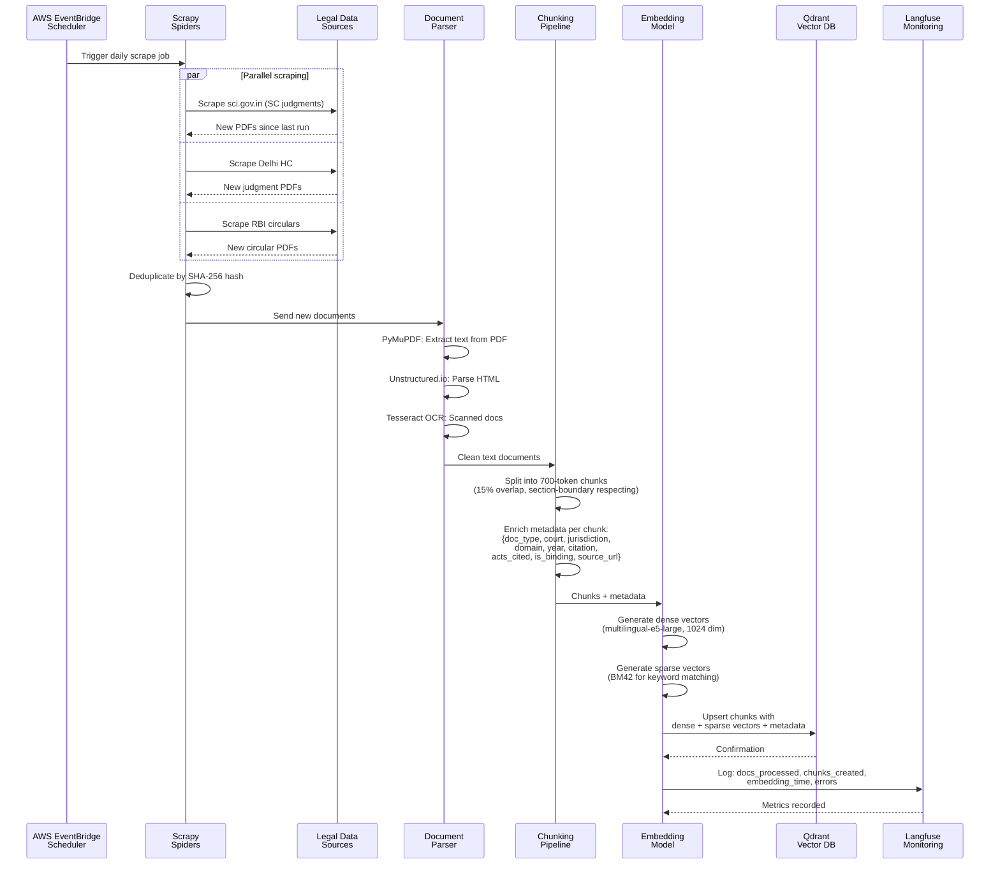
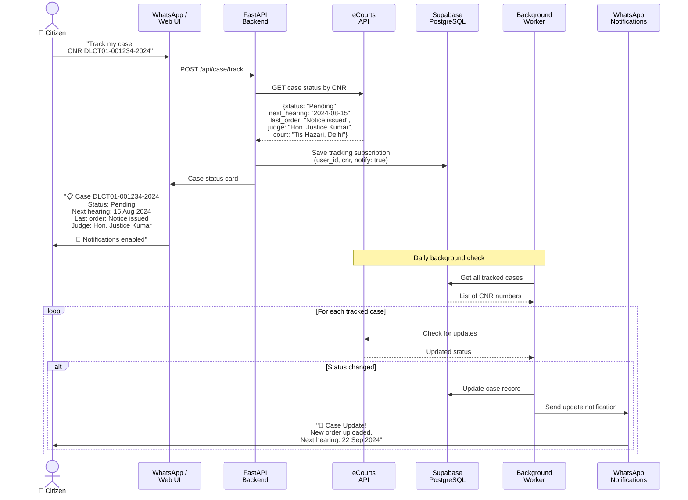

# Nyay.AI — Sequence Diagrams

## 1. Core RAG Query Flow (WhatsApp)

The primary interaction — a citizen asks a legal question via WhatsApp.

---

## 2. Document Generation Flow

When a citizen needs a legal document (e.g., consumer complaint, RTI, legal notice).

---

## 3. Lawyer Connect & Referral Flow

When the system connects a citizen with a verified advocate.

---

## 4. Government Scheme Eligibility Flow

---

## 5. Data Ingestion Pipeline (Backend)

How new legal documents flow from source to vector DB.

---

## 6. Case Status Tracking Flow

