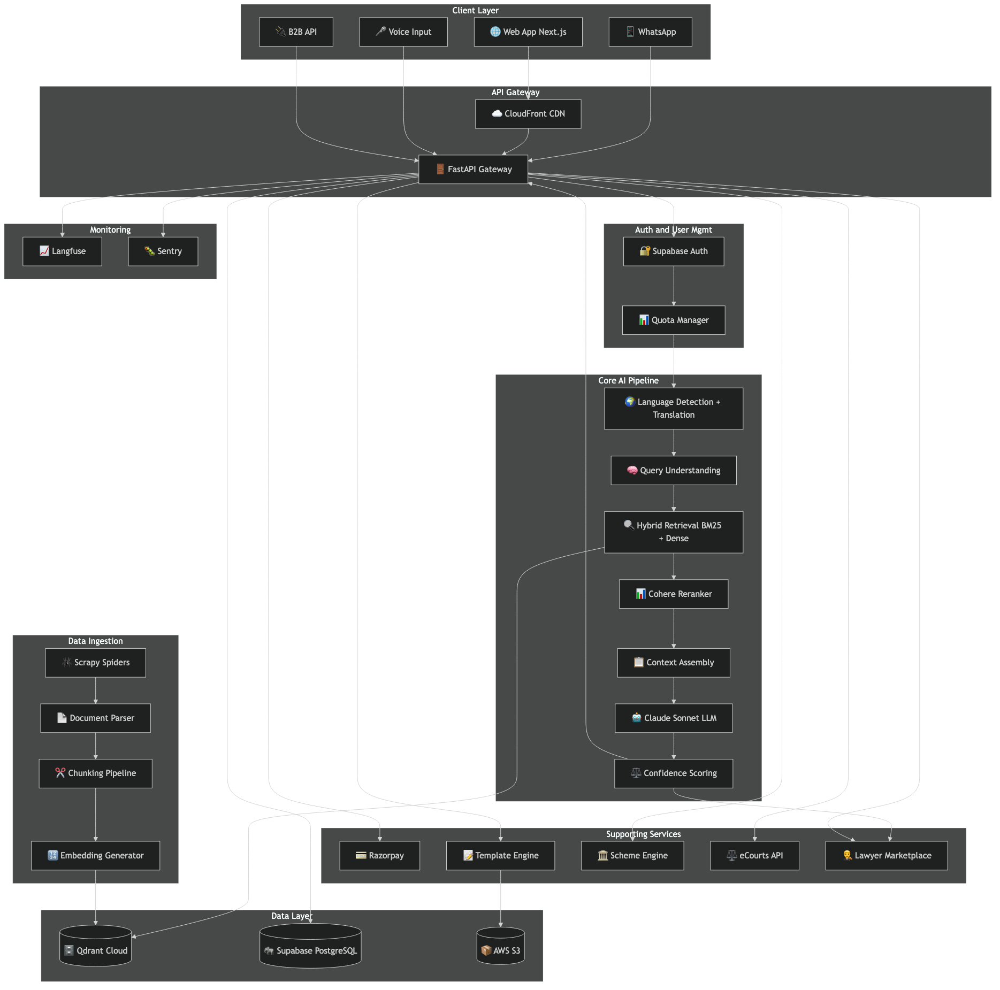
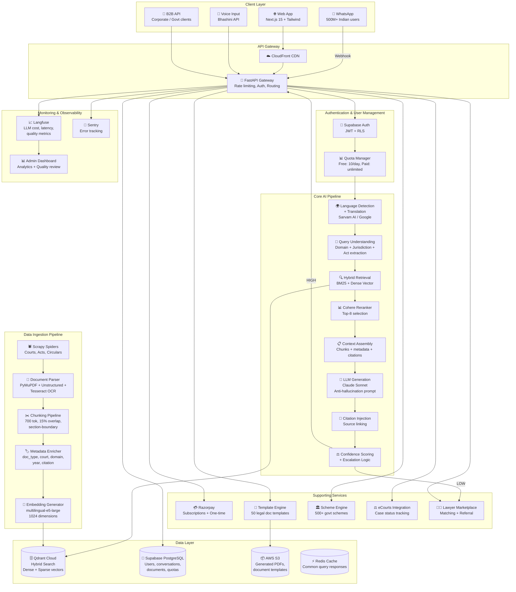
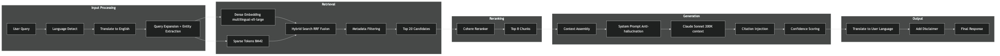
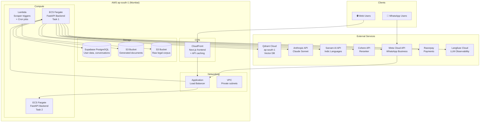
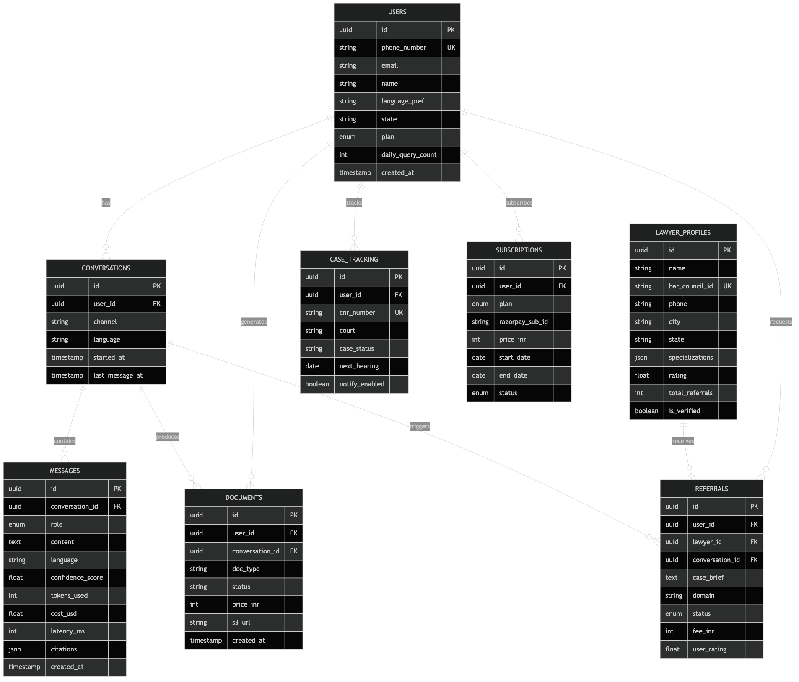
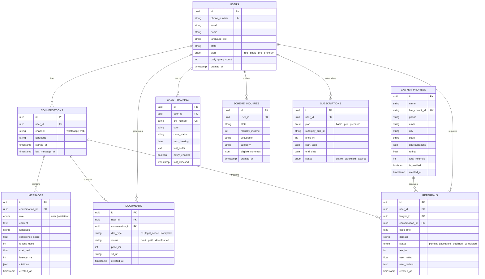

# Nyay.AI — System Architecture

## 1. High-Level Architecture

Mermaid source

---

## 2. RAG Pipeline Detail

```mermaid
graph LR
    subgraph "Input Processing"
        Q[User Query] --> LD[Language Detect]
        LD --> TR[Translate to English<br/>if non-English]
        TR --> QE[Query Expansion<br/>+ Entity Extraction]
    end

    subgraph "Retrieval"
        QE --> DE[Dense Embedding<br/>multilingual-e5-large]
        QE --> SP[Sparse Tokens<br/>BM42]
        DE --> HY[Hybrid Search<br/>RRF Fusion<br/>α = tuned weight]
        SP --> HY
        HY --> MF[Metadata Filtering<br/>domain, jurisdiction,<br/>court level, year]
        MF --> TOP[Top-20 Candidates]
    end

    subgraph "Reranking"
        TOP --> CR[Cohere Reranker<br/>Cross-encoder scoring]
        CR --> T8[Top-8 Chunks<br/>selected]
    end

    subgraph "Generation"
        T8 --> CA[Context Assembly<br/>+ Source metadata]
        CA --> SYS[System Prompt<br/>Anti-hallucination rules<br/>Temperature = 0]
        SYS --> LLM[Claude Sonnet<br/>200K context window]
        LLM --> CI[Citation Injection<br/>Link every claim to source]
        CI --> CS[Confidence Scoring<br/>HIGH / MEDIUM / LOW]
    end

    subgraph "Output"
        CS --> TRO[Translate to<br/>User Language]
        TRO --> DIS[Add Disclaimer<br/>'Legal info, not advice']
        DIS --> OUT[Final Response]
    end
```

Mermaid source

---

## 3. Infrastructure Layout (AWS ap-south-1)

Mermaid source

---

## 4. Data Model (Core Entities)

Mermaid source

---

## 5. Technology Stack Summary

| Layer | Technology | Purpose |
|-------|-----------|---------|
| **Frontend** | Next.js 15 + Tailwind CSS | Web app with server components |
| **Backend** | FastAPI (Python 3.11) | Async REST API |
| **Auth** | Supabase Auth (JWT + RLS) | User authentication |
| **Database** | Supabase PostgreSQL | User data, conversations, metadata |
| **Vector DB** | Qdrant Cloud (ap-south-1) | Hybrid BM25 + dense vector search |
| **Primary LLM** | Claude Sonnet (Anthropic) | Response generation |
| **Indic LLM** | Sarvam AI | Hindi/Tamil/Telugu language understanding |
| **Embeddings** | multilingual-e5-large | 1024-dim dense vectors |
| **Reranking** | Cohere Rerank API | Cross-encoder relevance scoring |
| **RAG Orchestration** | LlamaIndex + LangChain | Ingestion + query pipelines |
| **Scraping** | Scrapy + Playwright | Legal data collection |
| **Document Parsing** | Unstructured.io + PyMuPDF + Tesseract | PDF/HTML extraction |
| **WhatsApp** | Meta Cloud API | Primary delivery channel |
| **Payments** | Razorpay | Subscriptions + one-time payments |
| **Cloud** | AWS ap-south-1 (ECS Fargate) | Compute + storage |
| **CDN** | CloudFront | Frontend + API caching |
| **Monitoring** | Langfuse + Sentry | LLM observability + error tracking |
| **CI/CD** | GitHub Actions + Docker | Automated deployment |

---

## 6. Security & Compliance

| Concern | Approach |
|---------|----------|
| **Data Residency** | All data in AWS ap-south-1 (Mumbai). Qdrant in ap-south-1. |
| **User Data** | Supabase RLS — users can only access their own data |
| **API Keys** | Environment variables, never committed. `.env` gitignored. |
| **Legal Boundary** | System prompt enforces "information not advice". Disclaimer on every response. |
| **WhatsApp Policy** | No unsolicited messages. Compliance with Meta commerce policy. |
| **Hallucination** | Temperature=0. Citation-only rule. Confidence scoring. Lawyer escalation. |
| **Data Source** | All public data under NDSAP 2012 + RTI Act. Zero licensing costs. |
